<div id="top" align="center"></div>
<br/>

<!-- PROJECT LOGO -->

<div align="center">
  <a href="https://github.com/Vinamra7/Puzzle_Realm">
    
  </a>
  <h3 align="center">
    Challenge yourself with our engaging puzzle and develop your abilities.
    <br />
    <br />
    <a href="https://main--charming-pavlova-e13b74.netlify.app/">Live Website</a>
  </h3>
</div>

<br/>

<!-- TABLE OF CONTENTS -->
<details>
  <summary>Table of Contents</summary>
  <ol>
     <li><a href="#domain">Domain</a></li>
    <li>
      <a href="#about-the-project">About The Project</a>
      <ul>
        <li><a href="#built-with">Tech Stack</a></li>
      </ul>
    </li>
    <li><a href="#soft-skills">Soft Skills</a></li>
    <li>
      <a href="#getting-started">Setup</a>
      <ul>
        <li><a href="#prerequisites">Prerequisites</a></li>
        <li><a href="#installation">Installation</a></li>
      </ul>
    </li>
    <li><a href="#Puzzle-Solution">Puzzle Solution</a></li>
    <li><a href="#my">My details</a></li>
  </ol>
</details>

<!-- DOMAIN -->
## Domain

- Full-Stack Web Development

<!-- ABOUT THE PROJECT -->
## About The Project

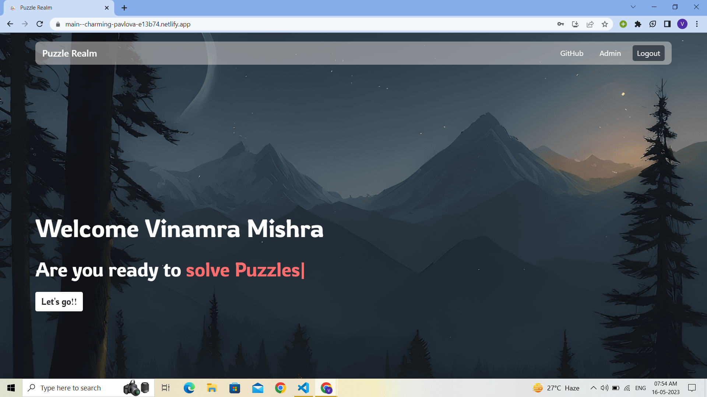

Puzzle Realm, a new way to challenge your mind! Puzzle Realm is the best online platform to test your puzzle-solving skills and embark on a treasure hunt adventure.

Here’s why:
* Engaging and challenging puzzles that will keep you on your toes.
* A treasure hunt-like experience that will take you on a journey through different realms.

<p align="right">(<a href="#top">Back to top</a>)</p>


### Built With

Technologies used - 
<p align="left" style="background-color:white"> 
<a href="https://reactjs.org/" target="_blank"> </a> 
&nbsp;&nbsp;
<a href="https://nodejs.org/en/" target="_blank"> </a>  
&nbsp;&nbsp;
<a href="https://planetscale.com/" target="_blank"> </a> 
&nbsp;&nbsp;
<a href="https://expressjs.com/" target="_blank">  </a>
&nbsp;&nbsp;
<a href="https://www.mysql.com/"></img></a>
&nbsp;&nbsp;
<a href="https://render.com/"></img></a>
</p>

<p align="right">(<a href="#top">Back to top</a>)</p>


<!-- Soft Skills-->
## Soft Skills
1. **Problem-Solving Abilities**:
    * The puzzles, riddles, and codes on my website are designed to challenge users' critical thinking, logic, and creativity.
    * By observing how users tackle these mind-bending challenges, I can gauge their problem-solving abilities and their ability to think outside the box.
2. **Attention to Detail**:
    * Delving deeper into my puzzles, users will discover hidden clues, subtle references, and specific instructions.
    * I believe that individuals with a sharp eye for detail, who can identify patterns and make connections, excel in these challenging quests.
3. **Adaptability**:
    * As users progress through my puzzling realm, they encounter diverse challenges that demand adaptability and resourcefulness.
    * By assessing users' ability to adapt their problem-solving strategies, explore new avenues, and apply different techniques, I can identify their level of adaptability.
4. **Communication**:
    *  While my puzzles are primarily designed for individual solving, I recognize the value of effective communication.
    * I provide opportunities for users to engage with me, the creator, to seek hints and exchange insights.
    * Proficient written and verbal communication skills can enhance the puzzle-solving experience and showcase strong soft skills.

    <p align="right">(<a href="#top">Back to top</a>)</p>
<!-- GETTING STARTED -->

## Getting Started

To get a local copy up and running follow these simple example steps.

### Prerequisites

This is an example of how to list things you need to use the software and how to install them.
* npm
  ```sh
  npm install npm@latest -g
  ```

### Installation


1. Clone the repo
   ```sh
   https://github.com/Vinamra7/Puzzle_Realm.git
   ```
#### For Client
1. Install NPM packages
   ```sh
   npm install
   ```
2. Create a .env file and add following data - 
   ```sh
   REACT_APP_SERVER_URL="SERVER_URL"
   ```
3. To run the frontend -
   ```sh 
   npm run start
   ```
#### For Server
1. Install NPM packages
   ```sh
   npm install
   ```
2. Create a .env file and add following data - 
   ```sh
    sql_host = "MYSQL_HOST_NAME"
    sql_user = "MYSQL_USERNAME"
    sql_password = "MYSQL_PASSWORD"
    sql_database = "MYSQL_Database_NAME"
    ```
3. To run the backend -
   ```sh 
   nodemon index.js
   ```
   

<p align="right">(<a href="#top">Back to top</a>)</p>

## Puzzle Solution

### Puzzle 1

* Clue 1 Presents a riddle to the user 
#### question
* "I have keys but no locks, space but no room. You can enter, but can't go outside. What am I?"
#### answer keyboard

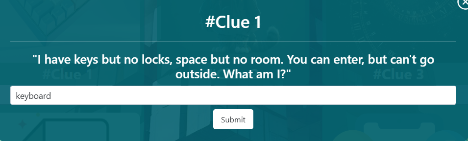</img>

* User is presented A connected Hint of Puzzle 2

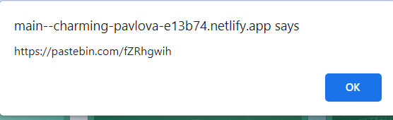

* The connecting hint routes to pasteBin which contains a hint to install python library IMAGEHIDE for next puzzle

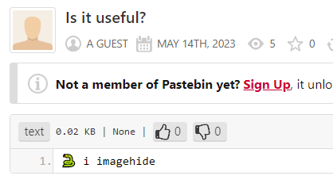

* Install the library required for the next puzzle
```sh
    pip install imagehide
```
### Puzzle 2

* Puzzle 2 presents a QR code to the user
<br/>
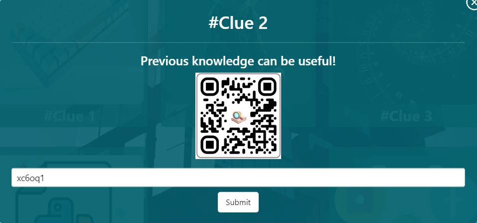

#### DeadEnd 1
* The QR code is a dead end and leads to a dead end page
<br/>
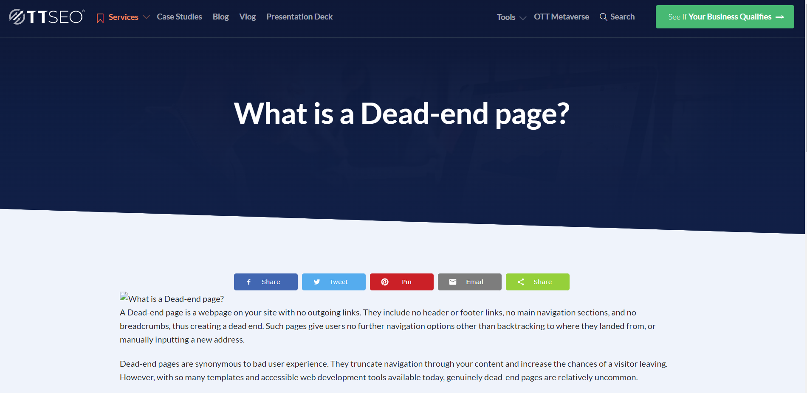

* The Puzzle's solution is hidden in medta_data of the QR code user can download the QR code and use it in ImageHide library to extract the solution
```sh
    import imagehide
```
#### Solution of Puzzle 2
* xc6oq1

* User is presented with connecting hint to Puzzle 3
<br/>
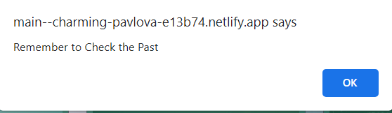

### Puzzle 3

* Puzzle 3 presents a Dead PasteBin link to the user
<br/>
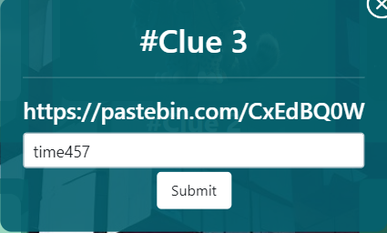

#### DeadEnd 2
* The PasteBin link is a dead end and leads to a dead end page
<br/>
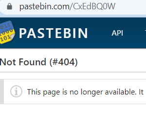

* To get the Solution user show now think about the connection hint 2
* which was to check the !!PAST!!

#### Solution of Puzzle 3
* User can use WAYBACK MACHINE to check the PAST screenshot of the dead pastebin link

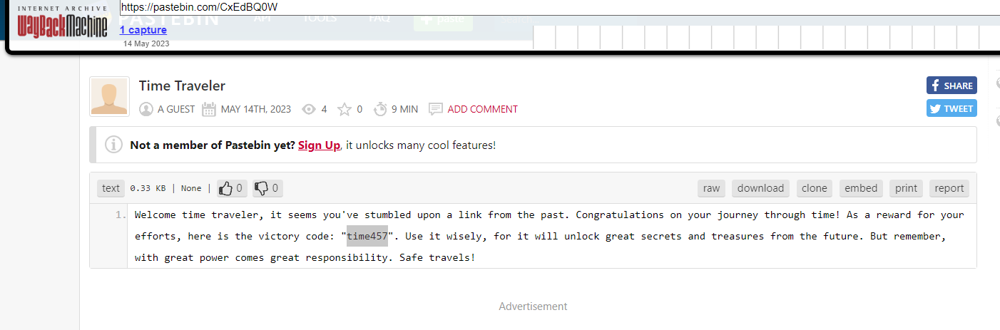

#### answer 
* "time457"

* User is presented with connecting hint to Puzzle 4

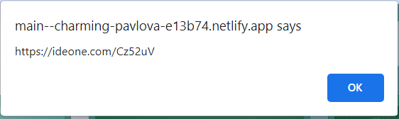

### Puzzle 4
* Puzzle 4 is a random Paragraph which is the input for the code given in connecting hint 3

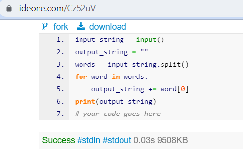
<br/>
* Provide the entire paragraph as input to the code given in connecting hint 3

#### Solution of Puzzle 4
* EhfiefmabandIfvwglpahfiydmcpybwtenintfpNocahdiyphbicahpeoymhaowMsctydsacwfopoaryiosaufchasioyohaqol

### Puzzle 5
* Puzzle 5 is a riddle "The URL to the fourth face inside a book reveals the creator."

#### Solution of Puzzle 5
<a href="www.facebook.com/4">www.facebook.com/4</a> reveals the profile of Mark Zuckerberg (creator of facebook)

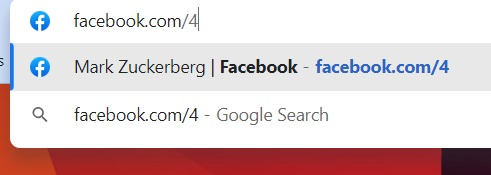

#### answer
* mark zuckerberg